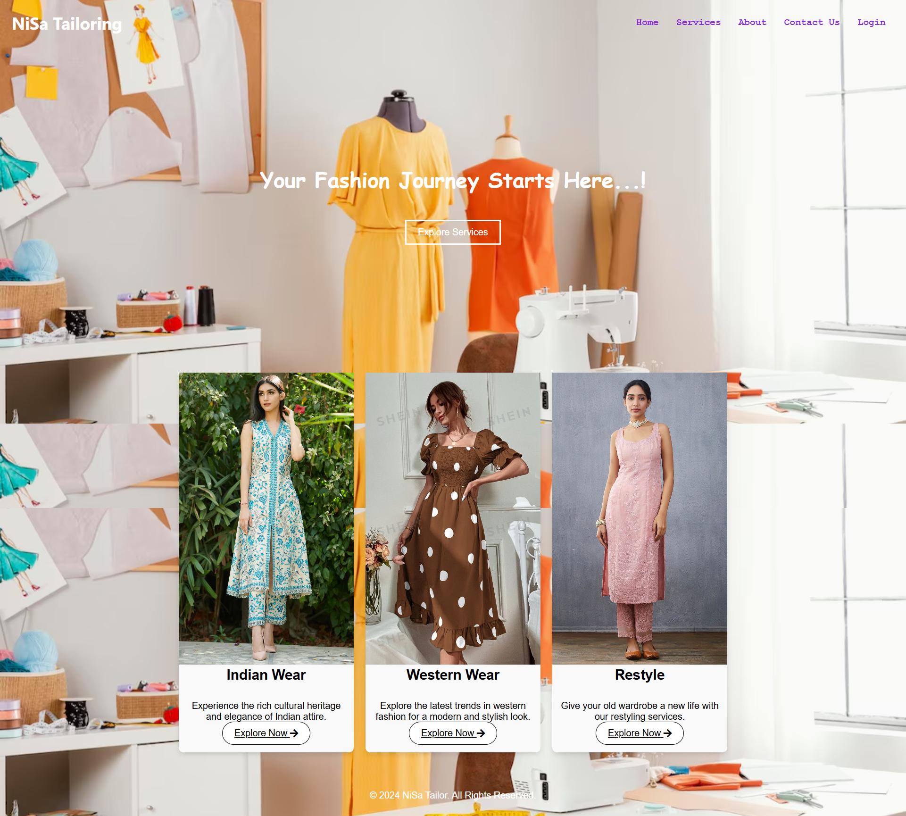

# Tailoring_Website
 
# NiSa Tailoring Website



## Project Overview

Welcome to the NiSa Tailoring website repository! This website is a modern, stylish platform designed for a tailoring business, offering services in Indian Wear, Western Wear, and Restyling. The website is designed to showcase the business's services, engage customers, and provide a seamless online experience.

### Key Features
- **Home Page** with a hero section, showcasing fashion categories and a call-to-action for exploring services.
- **Service Categories** with options for Indian Wear, Western Wear, and Restyle.
- **Responsive Design** for accessibility across devices.
- **Dynamic Content** powered by Node.js, Express.js, and MongoDB.

## Technologies Used

- **HTML** - Structure of the website
- **CSS** - Styling and layout design
- **Node.js** - Server-side JavaScript for backend operations
- **Express.js** - Framework for handling server routes and middleware
- **MongoDB** - Database for storing user and service information

## Installation

1. **Clone the Repository**
   ```bash
   git clone https://github.com/your-username/nisa-tailoring.git
   cd nisa-tailoring

Install Dependencies

bash
Copy code
npm install
Configure MongoDB

Ensure MongoDB is installed and running.
Update the MongoDB connection string in the configuration file (config.js or .env).
Run the Application

bash
Copy code
npm start
The server will start on http://localhost:3018.

Folder Structure
perl
Copy code
Tailoring_Website/
├── .vscode/                # VS Code settings
├── LOGIN/                  # Login-related files
├── index.html              # Homepage file
├── indian-wear.html        # Indian Wear section file
├── western-wear.html       # Western Wear section file
├── Restyling.html          # Restyling section file
├── about.html              # About page file
├── contact.html            # Contact page file
├── services.html           # Services page file
├── package.json            # NPM package configuration
├── package-lock.json       # NPM lock file for dependencies
├── style.css               # Main CSS styles
└── script.js               # JavaScript for interactivity
